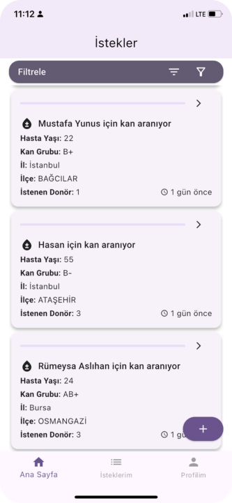
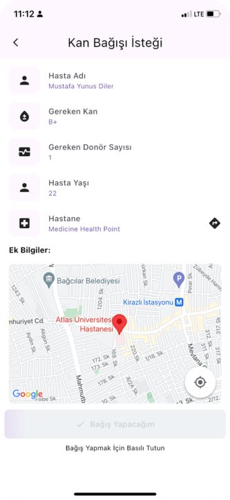
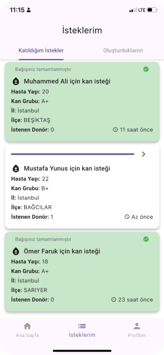
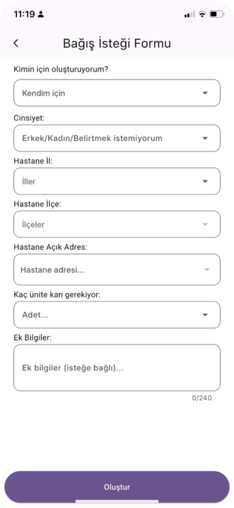

# 🩸 KanVer - Blood Donation App

KanVer is a mobile application that connects blood donors with those in need. The app allows users to create blood donation requests, find suitable donors, and receive location-based notifications. 

📱 **Platform:** Flutter (iOS & Android)  
🌐 **Backend:** Flask (Python)  
☁️ **Database:** MySQL on AWS  
🔑 **Authentication:** Firebase  

---

## 📷 **Screenshots**

<table>
  <tr>
    <td align="center" width="25%">
      
       
      <b>Home Screen</b>
       
      Personalized homepage of the application showing open requests.
    </td>
    <td align="center" width="25%">
      
       
      <b>Request Details</b>
       
      Request details and the location of the hospital on Google Maps.
    </td>
    <td align="center" width="25%">
      
       
      <b>My Requests</b>
       
      "My Requests" page showing the requests the user has donated or created.
    </td>
    <td align="center" width="25%">
      
       
      <b>Create Request</b>
       
      "Add Request" page, hospital names are taken from Google Maps API with City and District values.
    </td>
  </tr>
</table>

## 🎥 **Demo Video**

  

---

## 🚀 **Features**
- **User Registration & Login:** Firebase Authentication-based login system.
- **Create Blood Donation Requests:** Users can create blood donation requests based on their needs.
- **Blood Type Matching:** The system matches users with compatible blood donors.
- **Map Integration:** Displays nearby hospitals and donation points using Google Maps API.
- **Proximity-Based Notifications:** Users receive email notifications based on their location.
- **Donation Tracking:** Users can track their past donations and requests.
- **Admin Panel:** A ReactJS-based panel for administrators to manage requests.

---

## 🛠 **Technologies Used**
| **Component** | **Technology** |
|-------------|--------------|
| **Mobile Application** | Flutter |
| **API Usage** | Google Maps API, TC ID Verification API |
| **Notification System** | Brevo Mail API |
| **Database** | MySQL (AWS) |
| **Backend** | Flask (Python) |
| **Server Hosting** | Google Cloud |
| **Admin Panel** | ReactJS |
| **Authentication** | Firebase Authentication |

---

## 🔧 **Setup & Installation**

### 📌 **Requirements**
- Flutter SDK (`>=3.5.4`)
- Firebase account

### 🛠 **Starting the Flutter Project**
1. Clone the repository:  
   `git clone https://github.com/CoderBees-ITU/KanVer-Frontend.git`  
   `cd KanVer-Frontend`  

2. Install dependencies:  
   `flutter pub get`  

3. Configure Firebase:  
   - Download the `google-services.json` file from the Firebase Console and place it in `android/app/`.  
   - Download the `GoogleService-Info.plist` file from the Firebase Console and place it in `ios/Runner/`.  

4. Set the Backend API URL:  
   - Update the `API_URL` variable in `lib/utils/constants.dart` with the backend URL.

5. Run the application:  
   `flutter run`  

---

## 🔗 Related Repositories
Here are the related repositories for different components of the **KanVer** project:

| Repository | Description |
|------------|------------|
| [KanVer Admin Panel (Frontend)](https://github.com/CoderBees-ITU/Kanver-AdminFrontend) | ReactJS-based admin panel for managing blood donation requests. |
| [KanVer UI/UX Design](https://github.com/CoderBees-ITU/KanVer-Design) | UI/UX design files and prototypes for the mobile and web applications. |
| [KanVer Mail Template](https://github.com/CoderBees-ITU/KanVer-Mail-Template) | Predefined email templates used for notifications in the KanVer system. |
| [KanVer Backend](https://github.com/CoderBees-ITU/Kanver-Backend) | Flask-based backend handling API requests, authentication, and database operations. |

---

## 📧 Contact & Team Members
| **Name** | **Role** | **Email** |
|----------|----------------------------------------------|---------------------------|
| **Nurefşan Altın** | Mobile Developer | altinn21@itu.edu.tr |
| **Bünyamin Korkut** | Mobile & Backend Developer | krktbunyamin@gmail.com |
| **Mehmetcan Kul** | Backend Developer & Mail Notification Integration Specialist | kul21@itu.edu.tr |
| **Mustafa Yunus Diler** | Backend Developer & Testing Engineer | diler21@itu.edu.tr |
| **Samet Birol** | UI/UX Designer, DevOps & Testing Engineer | birol21@itu.edu.tr |
| **Ege Keklikçi** | Backend & Web Frontend Developer, Database Manager | keklikci23@itu.edu.tr |
| **Mehmet Onur Şahin** | Backend Developer | sahinme21@itu.edu.tr |

---

🎯 **KanVer - One Step Closer to Saving Lives!** 🚀
